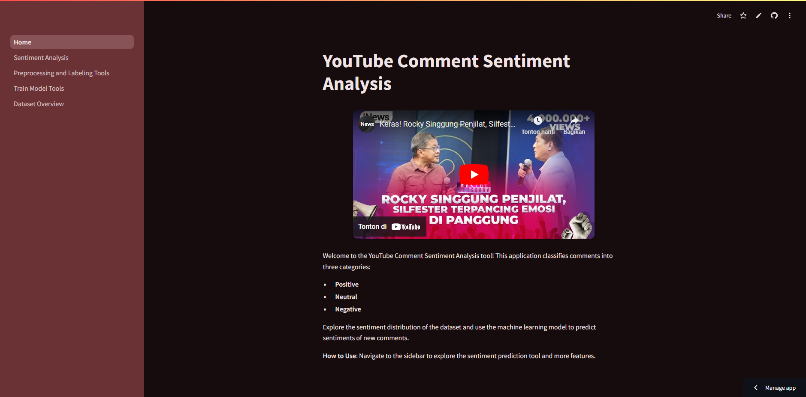

<!-- TABLE OF CONTENTS -->
<details>
  <summary>Table of Contents</summary>
  <ol>
    <li>
      <a href="#about-the-project">About The Project</a>
      <ul>
        <li><a href="#built-with">Built With</a></li>
      </ul>
    </li>
    <li>
      <a href="#getting-started">Getting Started</a>
      <ul>
        <li><a href="#installation">Prerequisites</a></li>
        <li><a href="#website">Installation</a></li>
      </ul>
    </li>
    <li><a href="#usage">Usage</a></li>
  </ol>
</details>

<!-- ABOUT THE PROJECT -->
## About The Project



This repository contains <a href="https://sentinalyt.streamlit.app">sentiment analysis website</a> project that classifies YouTube comments as positive, neutral, or negative based on <a href="https://youtu.be/oG852gUrDG8?si=y5gq79dyg0ENr4sX">this video YouTube</a>. The dataset includes pre-processed text in the cleaned_stemmed column, and sentiment labels are generated using an automated approach based on natural language processing (NLP). The project also includes a machine learning model trained on these labeled data, saved for future use.

<b>Key Objectives:</b>
* <b>Automated Sentiment Labeling:</b> Automatically classify text data into sentiment categories (positive, neutral, negative) using a pre-trained NLP model.
* <b>Text Preprocessing:</b> Utilize stemmed and cleaned comments for sentiment classification.
* <b>Model Training:</b> Train a machine learning model to classify comments based on their sentiment, using labeled data generated from text analysis.

<b>Features:</b>
* <b>Sentiment Labeling:</b> Automatically label the sentiment of comments without pre-existing labels.
* <b>Model Persistence:</b> Save the trained sentiment classifier model in .pkl format for easy reuse.
* <b>Machine Learning Model:</b> Train a machine learning model on the cleaned text data with labeled sentiments.

<p align="right">(<a href="#about-the-project">back to top</a>)</p>

### Built With

[![Python][Python]][Python-url]

<p align="right">(<a href="#about-the-project">back to top</a>)</p>

<!-- GETTING STARTED -->
## Getting Started

### Installation

1. Clone the repository
   ```bash
   git clone https://github.com/traviszusa/Sentiment-Analysis-Based-On-Youtube-Comments.git
   ```
2. Make an environment
   ```bash
   python -m venv .venv
   ```
3. Activate the environment
   ```bash
   .venv/Scripts/activate
   ```
4. Install requirements for running the program
   ```bash
   pip install -r requirements.txt
   ```

### Website

1. Activate the environment before
   ```bash
   .venv/Scripts/activate
   ```
2. Run app.py with streamlit library
   ```bash
   streamlit run Home.py
   ```

<p align="right">(<a href="#about-the-project">back to top</a>)</p>

<!-- USAGE EXAMPLES -->
## Usage

Open the website with a virtual environment or click this link on <a href="https://sentinalyt.streamlit.app">SentinalYT</a> and explore the features.

<p align="right">(<a href="#about-the-project">back to top</a>)</p>

[Python]: https://img.shields.io/badge/python-3670A0?style=for-the-badge&logo=python&logoColor=ffdd54
[Python-url]: https://www.python.org 